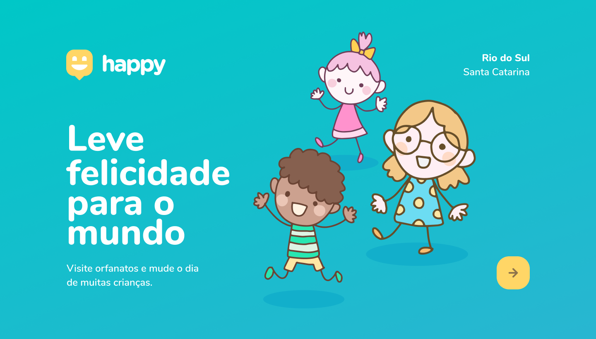

# *__Happy - Take happiness to the world__*

   
   
  
 
 

---

# :book: *__ABOUT__*

### *__This is a Rocketseat project that was presented at Next Level Week #3 in 2020.__*

Happy is an application that allows users to search for orphanages in their region, as well as add some orphanage - this application was thought to be simple and useful in people's daily lives. 

---

# :trophy: *__LEARNING__*

- [x] HTML5
- [x] CSS3
- [x] JavaScript
- [x] Node
- [x] SQL

---

 # :rocket: *__MORE INFORMATION ABOUT NLW__* 

+ official website: https://rocketseat.com.br/
+ blog: https://blog.rocketseat.com.br/
+ next level week (12/10 to 18/10): https://nextlevelweek.com/inscricao/3

---

 # :moyai: *__CONTRIBUTORS__*

<table>
  <tr>
    <td align="center"><a href="https://github.com/diego3g"> <b>Diego Fernandes</b></a> <a href="https://rocketseat.com.br/" title="Rocketseat">🚀</a></td>
    <td align="center" display="flex"><a href="https://github.com/maykbrito"> <b>Mayk Brito</b></a> <a href="https://rocketseat.com.br/" title="Rocketseat">🚀</a></td>
    <td align="center" display="flex"><a href="https://github.com/Rocketseat"> <b>Team Rocketseat</b></a> <a href="https://rocketseat.com.br/" title="Rocketseat">🚀</a></td>
  </tr>
  <tr>
</table>

---

# :construction: *__STATUS__*

+ Em construção
 

---

# *AUTOR*

  

*__Vitor Alves Pereira__*
  
Estudante de Web Design, UI/UX Design, HTML, CSS, Javascript e React na Origamid.

  

[comment]: <> (https%3A%2F%2Fmicrosoftoutlook.com)
